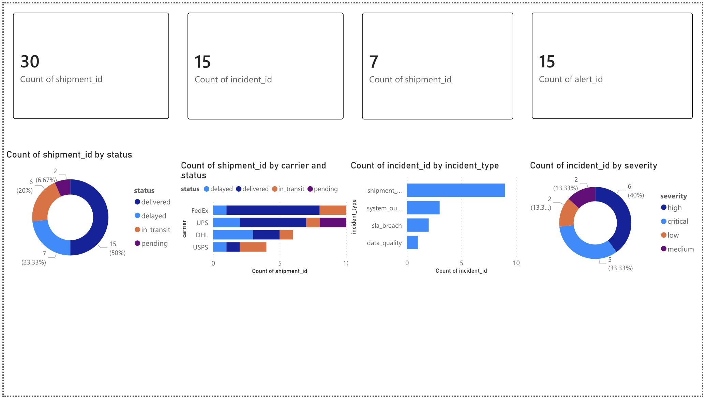
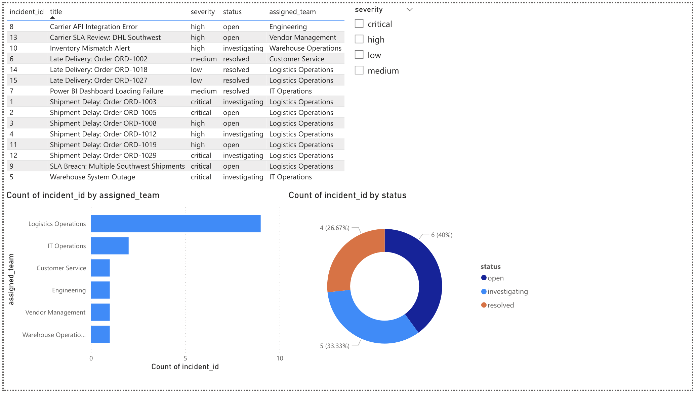
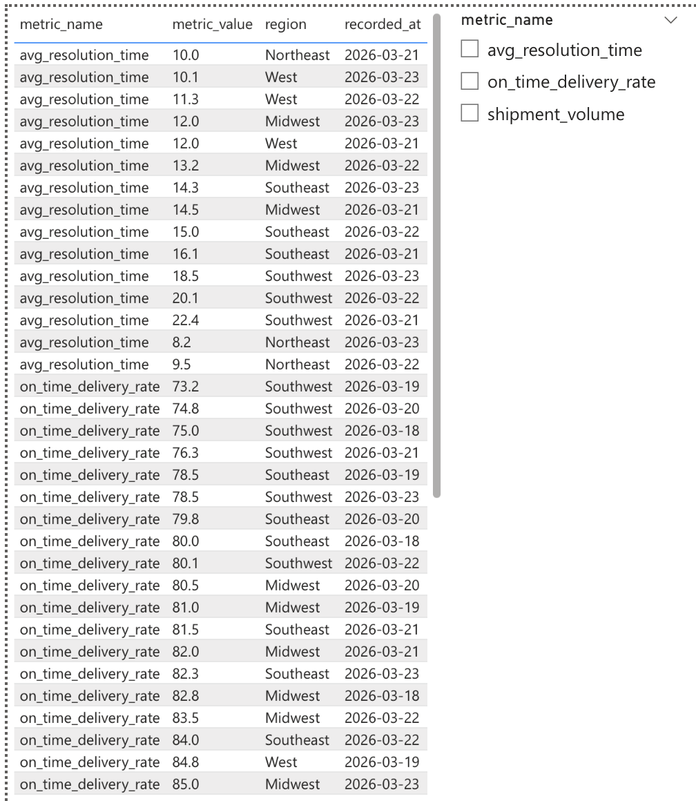

# Operations Command Center

A real-time operational monitoring, incident management, and analytics platform built for a logistics/distribution consulting engagement. Aggregates shipment data, detects anomalies, and provides executive-level dashboards for operations teams.

## Problem

A distribution client operating out of Texas was managing shipments across the US using fragmented systems — spreadsheets, separate carrier portals (FedEx, UPS, DHL), and manual check-ins. When shipments got delayed or SLAs were breached, nobody knew until customers complained. There was no single view of operations.

## Solution

A centralized command center that:
- Aggregates shipment, incident, and operational metric data into one platform
- Automatically detects delayed shipments and SLA breaches
- Provides real-time KPI dashboards for operations managers
- Generates AI-powered root-cause analysis for incidents
- Enables incident lifecycle management (create → assign → investigate → resolve)

## Power BI Dashboards

### Executive Overview
KPI cards (total shipments, incidents, delays, alerts), shipment status by carrier, incident breakdown by type and severity.



### Incident Analysis
Incident detail table with severity slicer, team workload distribution, and incident status breakdown.



### Operations Metrics
Operational KPI data table with metric filtering — on-time delivery rates, average resolution times, and shipment volumes across regions.



## Architecture

```
Data Sources (Shipments, IT Events, Metrics)
            ↓
   Anomaly Detection Engine
            ↓
   PostgreSQL Data Store
            ↓
   FastAPI Backend (REST API)
            ↓
   React Dashboard (Real-time UI)
        ↓           ↓
  Power BI      AI Summarizer
  Analytics     (Claude API)
```

## Tech Stack

| Layer      | Technology                          |
|------------|-------------------------------------|
| Frontend   | React 19, Material UI, Recharts     |
| Backend    | Python FastAPI, SQLAlchemy           |
| Database   | PostgreSQL 16                        |
| Analytics  | Power BI, DAX Measures               |
| AI         | Claude API (with rule-based fallback)|
| Infra      | Docker Compose                       |

## Key Features

- **Real-Time KPI Dashboard** — Open incidents, active alerts, delayed shipments, SLA compliance, avg resolution time
- **Power BI Analytics** — Interactive dashboards with DAX measures, severity slicers, and cross-filtered visuals
- **Incident Management** — Full lifecycle tracking: create, assign, investigate, and resolve operational incidents
- **Anomaly Detection** — Automated detection of shipment delays (>12hr threshold) and SLA breaches (>24hr)
- **AI Root-Cause Analysis** — Claude-powered incident summaries with recommended actions (rule-based fallback when no API key)
- **Alert System** — Real-time alerts with severity levels, acknowledgment workflow, and incident linking
- **Shipment Tracking** — End-to-end visibility into orders across carriers with status and priority tracking

## DAX Measures

Custom DAX measures built for the Power BI dashboards:

```dax
Open Incidents =
CALCULATE(
    COUNTROWS(incidents),
    incidents[status] IN {"open", "investigating"}
)

On-Time Delivery % =
DIVIDE(
    COUNTROWS(FILTER(shipments, shipments[status] = "delivered"
        && shipments[actual_delivery] <= shipments[expected_delivery])),
    COUNTROWS(FILTER(shipments, shipments[status] = "delivered")),
    0
) * 100

Avg Resolution Hours =
AVERAGEX(
    FILTER(incidents, NOT(ISBLANK(incidents[resolved_at]))),
    DATEDIFF(incidents[created_at], incidents[resolved_at], HOUR)
)
```

## Quick Start

### Docker (Recommended)

```bash
docker compose up
```

- Frontend: http://localhost:5173
- Backend API: http://localhost:8000
- API Docs: http://localhost:8000/docs

### Manual Setup

```bash
# Backend
cd backend
python3 -m venv venv
source venv/bin/activate
pip install -r requirements.txt
uvicorn app.main:app --reload

# Frontend
cd frontend
npm install
npm run dev

# Database (requires PostgreSQL running)
createdb opscenter
psql -U postgres -d opscenter -f data/seed_data.sql
```

### Power BI

1. Open Power BI and import the CSV files from `data/csv/`
2. Load all 4 tables: shipments, incidents, alerts, operations_metrics
3. Build dashboards using the DAX measures above

### AI Integration (Optional)

```bash
export ANTHROPIC_API_KEY=your_key_here
```

Without a key, the system uses intelligent rule-based fallback summaries.

## API Endpoints

| Method | Endpoint                              | Description                    |
|--------|---------------------------------------|--------------------------------|
| GET    | `/api/metrics/kpi`                    | Dashboard KPI summary          |
| GET    | `/api/incidents`                      | List incidents (filterable)    |
| POST   | `/api/incidents`                      | Create incident                |
| PATCH  | `/api/incidents/:id`                  | Update incident                |
| GET    | `/api/incidents/trend`                | Incident trend over time       |
| GET    | `/api/alerts`                         | List alerts                    |
| PATCH  | `/api/alerts/:id/acknowledge`         | Acknowledge alert              |
| GET    | `/api/shipments`                      | List shipments                 |
| GET    | `/api/metrics`                        | Operational metrics            |
| GET    | `/api/metrics/delays-by-region`       | Delay distribution by region   |
| POST   | `/api/detect/run`                     | Trigger anomaly detection scan |
| POST   | `/api/detect/incidents/:id/ai-summary`| Generate AI root-cause summary |

## Design Decisions

- **FastAPI over Express** — Native Python data processing, async support, automatic OpenAPI docs
- **Power BI for analytics** — Enterprise-grade BI tool with DAX for complex business logic; demonstrates real analytics engineering skills
- **Rule-based fallback for AI** — System remains fully functional without API key; no hard dependency on external service
- **Simulated realistic data** — 30 shipments across 5 TX origins, 15 incidents, 15 alerts, 55 metric records across 5 regions — mirrors production patterns without exposing real data
- **Dark theme UI** — Operations centers typically use dark interfaces to reduce eye strain during extended monitoring

## Future Improvements

- Streaming data ingestion (Kafka / Redis Streams)
- Predictive delay scoring with ML models
- Role-based access control (Admin / Operator / Viewer)
- Email/Slack alert notifications
- Power BI embedded analytics via API
- Automated incident recommendations
- WebSocket real-time dashboard updates
